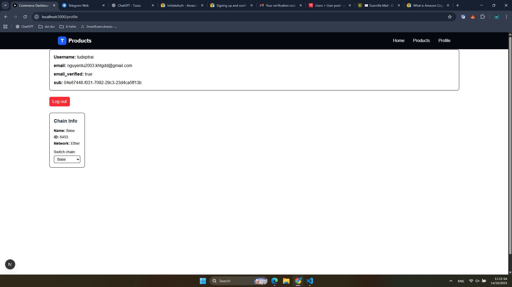
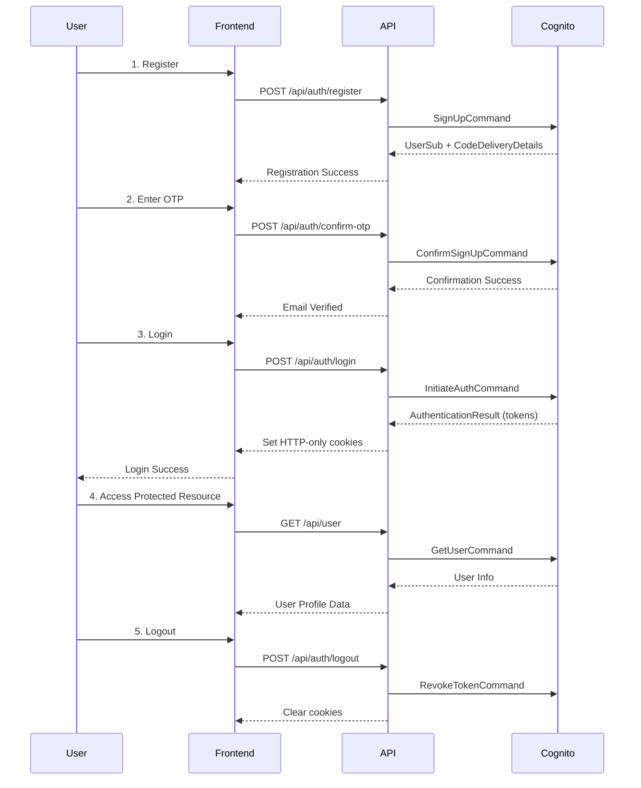

# AWS Cognito Custom Authentication Guide

> 📘 A complete, production-ready guide for integrating **AWS Cognito authentication** into a **Next.js 15+** application. Includes user registration, OTP verification, token management, and user info retrieval.

## 🚀 Overview

This guide demonstrates how to implement a complete authentication system using AWS Cognito's custom authentication flow without relying on the Hosted UI. Perfect for applications requiring full control over the user experience and UI design.

### Key Features

- ✅ Custom user registration and email verification
- ✅ OTP confirmation and resend functionality
- ✅ Username/password authentication
- ✅ Secure token management with HTTP-only cookies
- ✅ Complete user session management
- ✅ TypeScript support with AWS SDK v3

## 🛠️ Tech Stack & Dependencies

- **Framework**: Next.js 15.5.4 with Turbopack
- **Runtime**: Node.js v22.17.0
- **Package Manager**: pnpm 10.12.4
- **Authentication**: AWS Cognito (Custom Flow)
- **UI**: React 19.1.0 + TailwindCSS 4
- **AWS SDK**: @aws-sdk/client-cognito-identity-provider 3.908.0

### Required Dependencies

Ensure your `package.json` includes these dependencies:

```json
{
  "dependencies": {
    "@aws-sdk/client-cognito-identity-provider": "^3.908.0",
    "next": "15.5.4",
    "react": "19.1.0",
    "react-dom": "19.1.0",
    "lucide-react": "^0.545.0"
  },
  "devDependencies": {
    "@tailwindcss/postcss": "^4",
    "@types/node": "^20",
    "@types/react": "^19",
    "@types/react-dom": "^19",
    "tailwindcss": "^4",
    "typescript": "^5"
  }
}
```

---

## 1️⃣ Environment Variables

Create a `.env.local` file in your project root with the following configuration:

```bash
# AWS Cognito Configuration
NEXT_PUBLIC_COGNITO_CLIENT_ID=2nj68s2iqept9lxxxxxxxxxxx
NEXT_PUBLIC_COGNITO_CLIENT_SECRET=jq9qd26jn32kv4sehsb42t2bku5jkgbxxxxxxxxxxxxxxxxxx
NEXT_PUBLIC_COGNITO_ISSUER=https://cognito-idp.us-east-1.amazonaws.com/us-east-1_YourPoolId
NEXT_PUBLIC_COGNITO_USER_POOL_ID=us-east-1_YourPoolId
NEXT_PUBLIC_COGNITO_DOMAIN=https://us-east-1hetka1c37.auth.us-east-1.amazoncognito.com
NEXT_PUBLIC_LOGOUT_REDIRECT_URI=http://localhost:3000/login
```

**Important**: Replace all placeholder values with your actual AWS Cognito configuration.

---

## 2️⃣ AWS Cognito Setup

### Creating a User Pool

1. Go to the [AWS Cognito Console](https://console.aws.amazon.com/cognito)
2. Click **Create user pool**
3. Configure authentication settings:
   - **Sign-in options**: Email or Username
   - **Password policy**: Configure according to your security requirements
   - **User account recovery**: Email only
   - **Self-registration**: Enabled
   - **Required attributes**: `email`

📸 <!-- IMAGE: user-pool-creation -->

**Result**: Save your `User Pool ID`

> Example: `us-east-1_ABC123DEF`

### Creating an App Client

1. In your User Pool → **App integration** → **App clients**
2. Click **Create app client**
3. Configure the app client:
   - **App client name**: `demo project`
   - **Authentication flow**: ✅ **ALLOW_USER_PASSWORD_AUTH**
   - **Authentication flow**: ✅ **ALLOW_REFRESH_TOKEN_AUTH**
   - **Generate client secret**: ✅ **Yes** (required for server-side operations)

📸 <!-- IMAGE: app-client-creation -->

**Important**: Enable `ALLOW_USER_PASSWORD_AUTH` flow for custom authentication.

**Result**: Save your `Client ID` and `Client Secret`

---

## 3️⃣ API Implementation

### Helper: generateSecretHash(username: string): string

Rất hay — hàm này chính là phần **Cognito client-side signature** mà AWS yêu cầu khi App Client có **Client Secret** được bật.
Dưới đây là phần mô tả (viết kiểu README, chuẩn kỹ thuật, trích dẫn đúng tài liệu AWS Cognito):

---

### 🔐 `generateSecretHash(username: string): string`

**Purpose:**
Generates the **Cognito Secret Hash**, a Base64-encoded HMAC-SHA256 signature used to securely authenticate a user or client against the Cognito User Pool when the App Client has a **Client Secret** enabled.

**Location:**
`src/helper/cognitoHash.ts`

**Source:**

```typescript
import crypto from "crypto";

/**
 * Generate Cognito Secret Hash
 * @param username User’s username or email
 * @returns Base64-encoded HMAC-SHA256 hash
 */
export function generateSecretHash(username: string) {
  const clientId = process.env.NEXT_PUBLIC_COGNITO_CLIENT_ID!;
  const clientSecret = process.env.NEXT_PUBLIC_COGNITO_CLIENT_SECRET!;

  const hmac = crypto.createHmac("SHA256", clientSecret);
  hmac.update(username + clientId);
  return hmac.digest("base64");
}
```

---

#### 🧠 How It Works

AWS Cognito requires a **SecretHash** parameter in several API calls—such as `SignUpCommand`, `InitiateAuthCommand`, and `RespondToAuthChallengeCommand`—**only when** your App Client has a **Client Secret**.
The Secret Hash acts as a **digital signature** verifying that the request originates from your trusted client.

The hash is generated with this formula:

[
\text{SecretHash} = \text{Base64Encode}\left( \text{HMAC-SHA256}( \text{username} + \text{clientId}, \text{clientSecret} ) \right)
]

Where:

* **username** → The user’s Cognito username or email.
* **clientId** → Your Cognito App Client ID.
* **clientSecret** → The App Client Secret generated by Cognito.

---

#### 📘 References

* AWS Cognito Docs → [Computing secret hash values](https://docs.aws.amazon.com/cognito/latest/developerguide/signing-up-users-in-your-app.html#cognito-user-pools-computing-secret-hash)

---

#### ✅ Example Usage

```typescript
import { SignUpCommand } from "@aws-sdk/client-cognito-identity-provider";
import { generateSecretHash } from "@/helper/cognitoHash";

const command = new SignUpCommand({
  ClientId: process.env.NEXT_PUBLIC_COGNITO_CLIENT_ID!,
  Username: "john@example.com",
  Password: "SuperSecurePass123!",
  SecretHash: generateSecretHash("john@example.com"),
});
```

---

**Summary:**
The `generateSecretHash` function is a small but essential helper that ensures every Cognito authentication or registration request is securely signed according to AWS’s HMAC specification.


Now let's implement the complete authentication API routes using AWS SDK v3.

### User Registration API

Create `app/api/auth/register/route.ts`:

```typescript
import { NextResponse } from "next/server";
import {
  CognitoIdentityProviderClient,
  SignUpCommand,
  AdminConfirmSignUpCommand,
} from "@aws-sdk/client-cognito-identity-provider";
import { generateSecretHash } from "@/helper/cognitoHash";

export async function POST(req: Request) {
  const { username, password, email } = await req.json();

  const client = new CognitoIdentityProviderClient({ region: "us-east-1" });

  try {
    const command = new SignUpCommand({
      ClientId: process.env.NEXT_PUBLIC_COGNITO_CLIENT_ID!,
      Username: username,
      Password: password,
      SecretHash: generateSecretHash(username),
      UserAttributes: [{ Name: "email", Value: email }],
    });

    const result = await client.send(command);

    if (process.env.NODE_ENV !== "production") {
      try {
        const confirm = new AdminConfirmSignUpCommand({
          UserPoolId: process.env.NEXT_PUBLIC_COGNITO_USER_POOL_ID!,
          Username: username,
        });
        await client.send(confirm);
      } catch (err) {
        console.warn("Auto-confirm failed:", err);
      }
    }

    return NextResponse.json({
      success: true,
      message: "User registered successfully. Please verify your email.",
      data: result,
    });
  } catch (err: any) {
    console.error("Register failed:", {
      name: err.name,
      message: err.message,
      code: err.$metadata?.httpStatusCode,
    });
    let message = "Registration failed";
    if (err.name === "UsernameExistsException")
      message = "User already exists.";
    if (err.name === "InvalidPasswordException")
      message = "Password does not meet requirements.";
    if (err.name === "InvalidParameterException")
      message = "Invalid input parameters.";

    return NextResponse.json(
      { error: message, details: err.message },
      { status: 400 }
    );
  }
}
```

#### SignUpCommand Reference

| Parameter        | Type   | Required | Description                              |
| ---------------- | ------ | -------- | ---------------------------------------- |
| `ClientId`       | string | ✅       | Your Cognito App Client ID               |
| `ClientSecret`   | string | ✅       | Your Cognito App Client Secret           |
| `Username`       | string | ✅       | User's chosen username                   |
| `Password`       | string | ✅       | User's password (must meet policy)       |
| `SecretHash`     | string | ✅       | Computed HMAC-SHA256 hash of the username|
| `UserAttributes` | array  | ❌       | Additional user attributes (email, etc.) |


### OTP Confirmation API

Create `app/api/auth/confirm-otp/route.ts`:

```typescript
import { NextRequest, NextResponse } from "next/server";
import {
  CognitoIdentityProviderClient,
  ConfirmSignUpCommand,
  ConfirmSignUpCommandInput,
} from "@aws-sdk/client-cognito-identity-provider";

const client = new CognitoIdentityProviderClient({
  region: process.env.AWS_REGION!,
});

export async function POST(request: NextRequest) {
  try {
    const { username, confirmationCode } = await request.json();

    if (!username || !confirmationCode) {
      return NextResponse.json(
        { error: "Username and confirmation code are required" },
        { status: 400 }
      );
    }

    const params: ConfirmSignUpCommandInput = {
      ClientId: process.env.NEXT_PUBLIC_COGNITO_CLIENT_ID!,
      ClientSecret: process.env.NEXT_PUBLIC_COGNITO_CLIENT_SECRET!,
      Username: username,
      ConfirmationCode: confirmationCode,
    };

    const command = new ConfirmSignUpCommand(params);
    await client.send(command);

    return NextResponse.json({
      success: true,
      message: "Email verification successful. You can now log in.",
    });
  } catch (error: any) {
    console.error("OTP confirmation error:", error);

    return NextResponse.json(
      {
        error: error.name || "Confirmation failed",
        message: error.message || "Invalid or expired confirmation code",
      },
      { status: 400 }
    );
  }
}
```

#### ConfirmSignUpCommand Reference

| Parameter          | Type   | Required | Description                    |
| ------------------ | ------ | -------- | ------------------------------ |
| `ClientId`         | string | ✅       | Your Cognito App Client ID     |
| `ClientSecret`     | string | ✅       | Your Cognito App Client Secret |
| `Username`         | string | ✅       | User's username                |
| `ConfirmationCode` | string | ✅       | 6-digit code from email        |

### Resend OTP API

Create `app/api/auth/resend-otp/route.ts`:

```typescript
import { NextRequest, NextResponse } from "next/server";
import {
  CognitoIdentityProviderClient,
  ResendConfirmationCodeCommand,
  ResendConfirmationCodeCommandInput,
} from "@aws-sdk/client-cognito-identity-provider";

const client = new CognitoIdentityProviderClient({
  region: process.env.AWS_REGION!,
});

export async function POST(request: NextRequest) {
  try {
    const { username } = await request.json();

    if (!username) {
      return NextResponse.json(
        { error: "Username is required" },
        { status: 400 }
      );
    }

    const params: ResendConfirmationCodeCommandInput = {
      ClientId: process.env.NEXT_PUBLIC_COGNITO_CLIENT_ID!,
      ClientSecret: process.env.NEXT_PUBLIC_COGNITO_CLIENT_SECRET!,
      Username: username,
    };

    const command = new ResendConfirmationCodeCommand(params);
    const response = await client.send(command);

    return NextResponse.json({
      success: true,
      codeDeliveryDetails: response.CodeDeliveryDetails,
      message: "Confirmation code resent successfully.",
    });
  } catch (error: any) {
    console.error("Resend OTP error:", error);

    return NextResponse.json(
      {
        error: error.name || "Resend failed",
        message: error.message || "Failed to resend confirmation code",
      },
      { status: 400 }
    );
  }
}
```

### User Login API

Create `app/api/auth/login/route.ts`:

```typescript
import { NextRequest, NextResponse } from "next/server";
import {
  CognitoIdentityProviderClient,
  InitiateAuthCommand,
  InitiateAuthCommandInput,
} from "@aws-sdk/client-cognito-identity-provider";

const client = new CognitoIdentityProviderClient({
  region: process.env.AWS_REGION!,
});

export async function POST(request: NextRequest) {
  try {
    const { username, password } = await request.json();

    if (!username || !password) {
      return NextResponse.json(
        { error: "Username and password are required" },
        { status: 400 }
      );
    }

    const params: InitiateAuthCommandInput = {
      ClientId: process.env.NEXT_PUBLIC_COGNITO_CLIENT_ID!,
      ClientSecret: process.env.NEXT_PUBLIC_COGNITO_CLIENT_SECRET!,
      AuthFlow: "USER_PASSWORD_AUTH",
      AuthParameters: {
        USERNAME: username,
        PASSWORD: password,
      },
    };

    const command = new InitiateAuthCommand(params);
    const response = await client.send(command);

    if (response.AuthenticationResult) {
      const { AccessToken, IdToken, RefreshToken } =
        response.AuthenticationResult;

      const responseData = NextResponse.json({
        success: true,
        message: "Login successful",
      });

      responseData.cookies.set("accessToken", AccessToken!, {
        httpOnly: true,
        secure: process.env.NODE_ENV === "production",
        sameSite: "lax",
        maxAge: 60 * 60, 
        path: "/",
      });

      responseData.cookies.set("idToken", IdToken!, {
        httpOnly: true,
        secure: process.env.NODE_ENV === "production",
        sameSite: "lax",
        maxAge: 60 * 60, 
        path: "/",
      });

      responseData.cookies.set("refreshToken", RefreshToken!, {
        httpOnly: true,
        secure: process.env.NODE_ENV === "production",
        sameSite: "lax",
        maxAge: 30 * 24 * 60 * 60, 
        path: "/",
      });

      return responseData;
    }

    throw new Error("Authentication failed");
  } catch (error: any) {
    console.error("Login error:", error);

    return NextResponse.json(
      {
        error: error.name || "Login failed",
        message: error.message || "Invalid credentials",
      },
      { status: 401 }
    );
  }
}
```

#### InitiateAuthCommand Reference

| Parameter        | Type   | Required | Description                    |
| ---------------- | ------ | -------- | ------------------------------ |
| `ClientId`       | string | ✅       | Your Cognito App Client ID     |
| `ClientSecret`   | string | ✅       | Your Cognito App Client Secret |
| `AuthFlow`       | string | ✅       | Must be "USER_PASSWORD_AUTH"   |
| `AuthParameters` | object | ✅       | Contains USERNAME and PASSWORD |

---

### Logout API

Create `app/api/auth/logout/route.ts`:

```typescript
import { NextResponse } from "next/server";
import { cookies } from "next/headers";
import {
  CognitoIdentityProviderClient,
  RevokeTokenCommand,
} from "@aws-sdk/client-cognito-identity-provider";

export async function POST() {
  try {
    const cookieStore = cookies();
    const refreshToken = (await cookieStore).get("refreshToken")?.value;

    if (!refreshToken) {
      return NextResponse.json(
        { error: "Missing refresh token" },
        { status: 400 }
      );
    }

    const client = new CognitoIdentityProviderClient({ region: "us-east-1" });
    await client.send(
      new RevokeTokenCommand({
        Token: refreshToken,
        ClientSecret: process.env.NEXT_PUBLIC_COGNITO_CLIENT_SECRET,
        ClientId: process.env.NEXT_PUBLIC_COGNITO_CLIENT_ID!,
      })
    );

    const res = NextResponse.json({ success: true });
    const expired = new Date(0);

    res.cookies.set("accessToken", "", {
      httpOnly: true,
      secure: process.env.NODE_ENV === "production",
      sameSite: "lax",
      path: "/",
      expires: expired,
    });

    res.cookies.set("idToken", "", {
      httpOnly: true,
      secure: process.env.NODE_ENV === "production",
      sameSite: "lax",
      path: "/",
      expires: expired,
    });

    res.cookies.set("refreshToken", "", {
      httpOnly: true,
      secure: process.env.NODE_ENV === "production",
      sameSite: "lax",
      path: "/",
      expires: expired,
    });

    return res;
  } catch (err: any) {
    console.error("Logout error:", err);
    return NextResponse.json({ error: err.message }, { status: 500 });
  }
}
```

### Get User Info API

Create `app/api/user/route.ts`:

```typescript
import { NextResponse } from "next/server";
import { cookies } from "next/headers";
import {
  CognitoIdentityProviderClient,
  GetUserCommand,
} from "@aws-sdk/client-cognito-identity-provider";

const client = new CognitoIdentityProviderClient({ region: "us-east-1" });

export async function GET() {
  try {
    const cookieStore = cookies();
    const accessToken = (await cookieStore).get("accessToken")?.value;

    if (!accessToken) {
      return NextResponse.json(
        { error: "Missing access token" },
        { status: 401 }
      );
    }

    const res = await client.send(
      new GetUserCommand({ AccessToken: accessToken })
    );

    const userAttributes: Record<string, string> = {};
    res.UserAttributes?.forEach((attr) => {
      if (attr.Name) {
        userAttributes[attr.Name] = attr.Value ?? "";
      }
    });

    return NextResponse.json({
      username: res.Username,
      attributes: userAttributes,
    });
  } catch (err: any) {
    console.error("GetUser error:", err);
    return NextResponse.json({ error: err.message }, { status: 500 });
  }
}
```

#### GetUserCommand Reference

| Parameter     | Type   | Required | Description                   |
| ------------- | ------ | -------- | ----------------------------- |
| `AccessToken` | string | ✅       | Valid access token from login |

**Response includes**: username, userStatus, MFA settings, and all user attributes.


---

## 5️⃣ Frontend Integration Examples

### Registration Form Component

```typescript
"use client";

import { useState } from "react";

export default function RegisterForm() {
  const [formData, setFormData] = useState({
    username: "",
    email: "",
    password: "",
  });
  const [loading, setLoading] = useState(false);
  const [message, setMessage] = useState("");

  const handleSubmit = async (e: React.FormEvent) => {
    e.preventDefault();
    setLoading(true);
    setMessage("");

    try {
      const response = await fetch("/api/auth/register", {
        method: "POST",
        headers: { "Content-Type": "application/json" },
        body: JSON.stringify(formData),
      });

      const data = await response.json();

      if (response.ok) {
        setMessage(
          "Registration successful! Check your email for verification."
        );
      } else {
        setMessage(`Error: ${data.message}`);
      }
    } catch (error) {
      setMessage("Network error occurred");
    } finally {
      setLoading(false);
    }
  };

  return (
    <form onSubmit={handleSubmit} className="space-y-4">
      <input
        type="text"
        placeholder="Username"
        value={formData.username}
        onChange={(e) => setFormData({ ...formData, username: e.target.value })}
        required
        className="w-full p-2 border rounded"
      />
      <input
        type="email"
        placeholder="Email"
        value={formData.email}
        onChange={(e) => setFormData({ ...formData, email: e.target.value })}
        required
        className="w-full p-2 border rounded"
      />
      <input
        type="password"
        placeholder="Password"
        value={formData.password}
        onChange={(e) => setFormData({ ...formData, password: e.target.value })}
        required
        className="w-full p-2 border rounded"
      />
      <button
        type="submit"
        disabled={loading}
        className="w-full bg-blue-500 text-white p-2 rounded disabled:opacity-50"
      >
        {loading ? "Registering..." : "Register"}
      </button>
      {message && <p className="mt-2 text-center">{message}</p>}
    </form>
  );
}
```

---

## 6️⃣ End-to-End Flow Summary

| Step  | Description                | API Endpoint                 | AWS SDK Command                 | Purpose                             |
| ----- | -------------------------- | ---------------------------- | ------------------------------- | ----------------------------------- |
| **1** | User Registration          | `POST /api/auth/register`    | `SignUpCommand`                 | Create new user account             |
| **2** | Email Verification         | `POST /api/auth/confirm-otp` | `ConfirmSignUpCommand`          | Verify email with OTP               |
| **3** | Resend OTP (if needed)     | `POST /api/auth/resend-otp`  | `ResendConfirmationCodeCommand` | Resend verification code            |
| **4** | User Login                 | `POST /api/auth/login`       | `InitiateAuthCommand`           | Authenticate with username/password |
| **5** | MFA Challenge (if enabled) | `POST /api/auth/verify-mfa`  | `RespondToAuthChallengeCommand` | Verify TOTP code                    |
| **6** | Token Storage              | N/A                          | N/A                             | Store tokens in HTTP-only cookies   |
| **7** | Get User Info              | `GET /api/user`              | `GetUserCommand`                | Retrieve user profile data          |
| **8** | User Logout                | `POST /api/auth/logout`      | `RevokeTokenCommand`            | Clear tokens and revoke session     |

### Authentication Flow Diagram




---

## 7️⃣ AWS SDK Command Reference

### Complete Command Summary

| AWS SDK Command                 | Purpose            | Required Parameters                                                | Optional Parameters            |
| ------------------------------- | ------------------ | ------------------------------------------------------------------ | ------------------------------ |
| `SignUpCommand`                 | User registration  | ClientId, ClientSecret, Username, Password                         | UserAttributes, ValidationData |
| `ConfirmSignUpCommand`          | Email verification | ClientId, ClientSecret, Username, ConfirmationCode                 | ForceAliasCreation             |
| `ResendConfirmationCodeCommand` | Resend OTP         | ClientId, ClientSecret, Username                                   | -                              |
| `InitiateAuthCommand`           | User login         | ClientId, ClientSecret, AuthFlow, AuthParameters                   | ClientMetadata                 |
| `RespondToAuthChallengeCommand` | MFA verification   | ClientId, ClientSecret, ChallengeName, Session, ChallengeResponses | -                              |
| `GetUserCommand`                | Get user info      | AccessToken                                                        | -                              |
| `RevokeTokenCommand`            | Token revocation   | ClientId, ClientSecret, Token                                      | -                              |

### Error Handling Best Practices

```typescript
// Common Cognito error types and handling
const handleCognitoError = (error: any) => {
  switch (error.name) {
    case "UserNotConfirmedException":
      return "Please verify your email address before logging in";
    case "NotAuthorizedException":
      return "Invalid username or password";
    case "UserNotFoundException":
      return "User account not found";
    case "CodeMismatchException":
      return "Invalid verification code";
    case "ExpiredCodeException":
      return "Verification code has expired";
    case "InvalidPasswordException":
      return "Password does not meet requirements";
    case "UsernameExistsException":
      return "Username already exists";
    default:
      return error.message || "An unexpected error occurred";
  }
};
```

---

## 📚 Additional Resources

- [AWS Cognito Developer Guide](https://docs.aws.amazon.com/cognito/latest/developerguide/)
- [AWS SDK for JavaScript v3](https://docs.aws.amazon.com/AWSJavaScriptSDK/v3/latest/)

---

**End of Document**
